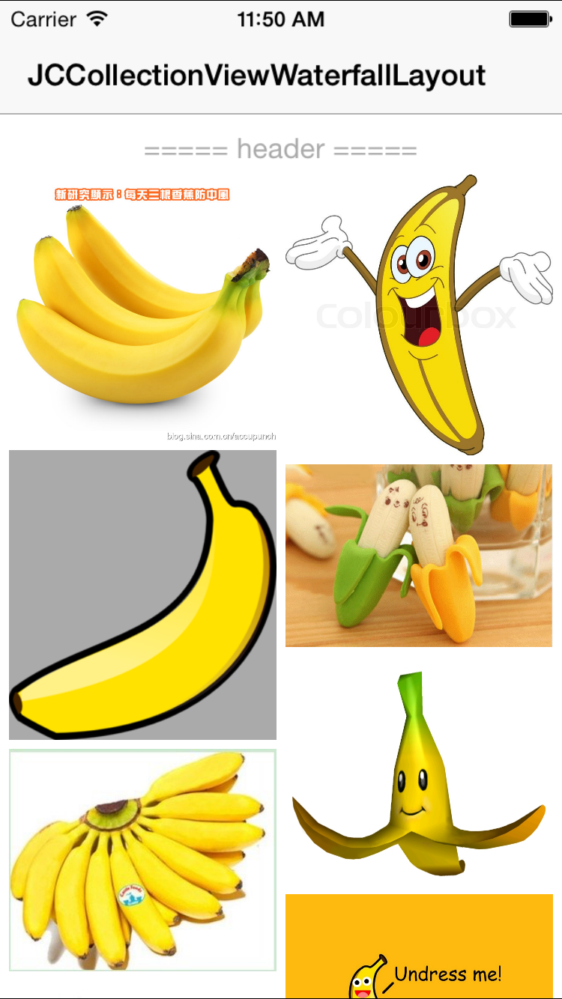

# JCCollectionViewWaterfallLayout

Support multiple section, and can add headerView and footerView.

 

## Installation

pod "JCCollectionViewWaterfallLayout"

## Usage

Refer to demo

## Author

[李京城](http://lijingcheng.github.io)

## License

MIT
